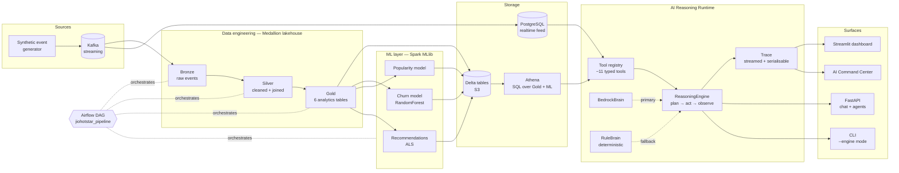

 # JioHotstar Media-Streaming Analytics 

A media-streaming analytics platform that takes raw viewing events all the way
to a bounded, observable AI reasoning runtime that can answer multi-step
analytics questions in natural language.


The repo is structured around three layers built on top of each other:

1. **Data engineering** — a Medallion lakehouse (Bronze → Silver → Gold) on
   Delta, fed by Kafka, orchestrated by Airflow, and queryable via Athena.
2. **Machine learning** — Spark MLlib models for churn, content popularity,
   and personalised recommendations, materialised as Gold tables.
3. **AI reasoning runtime** — a brain-agnostic plan → act → observe agent that
   chains typed tools over the Gold + ML lakehouse, with a deterministic
   offline fallback and a streamed reasoning trace.

> The reasoning runtime is the headline feature. It is intentionally small,
> bounded, observable, and crash-safe — not a wrapper around a framework.

---

## Highlights

| What | Why it matters |
|---|---|
| **Brain-agnostic reasoning engine** | The plan → act → observe loop is decoupled from the LLM. `BedrockBrain` and `RuleBrain` are interchangeable behind the same `Brain` protocol. |
| **Hybrid Bedrock + deterministic fallback** | When Bedrock is reachable the agent uses real LLM tool-use; otherwise it runs a fully offline rule planner. Mid-run failures fall back with a visible `FALLBACK` event. |
| **Observable `Trace`** | Every loop step is a structured event (`THOUGHT`, `TOOL_CALL`, `OBSERVATION`, `FALLBACK`, `SUMMARY`, `FINAL`, `ERROR`) streamed live to the UI and serialisable to JSON for replay/regression. |
| **Two-tier tool registry with SQL guardrail** | ~10 fixed templated tools cover the common cases; one `query_analytics` escape hatch generates SQL that passes a hardened validator (SELECT-only, table whitelist, no DDL/DML, no `INFORMATION_SCHEMA`) before reaching Athena. |
| **"The loop never crashes"** | Tool errors become observations. A brain failure triggers fallback. Repeated calls hit a loop guard. `MAX_STEPS=5` forces a summary. All paths produce a `FinalAnswer`. |
| **Offline-deterministic tests** | The full 59-test suite runs without AWS — all DB access funnels through one monkeypatchable seam (`datasources.py`). |
| **Replayable demos** | The dashboard's AI Agent section replays a real serialised `Trace` from a fixture file, so the showcase works with zero AWS. |
| **Medallion lakehouse + Airflow** | Bronze → Silver → Gold Delta tables, six Silver transforms with a 20-check validation script, six Gold analytics tables, all orchestrated by Airflow. |

---

## Architecture



---

## End-to-end pipeline

**Data engineering.** Synthetic viewing events stream into Kafka and land in the
Bronze layer as raw Delta tables. Six Silver transforms clean, type-coerce, and
join the events; a 20-check validation script gates promotion. The Gold layer
materialises six analytics tables (daily active users, content watch metrics,
genre popularity, user engagement, subscription metrics, content ratings) used
by the dashboard, the ML jobs, and the AI runtime. Airflow drives the whole
Medallion pipeline (`dags/jiohotstar_pipeline.py`).

**ML layer.** Three Spark MLlib jobs read Gold and write ML tables back into
the lakehouse:

| Model | Output table | Algorithm |
|---|---|---|
| Churn | `user_churn_prediction` | RandomForest |
| Content popularity | `content_popularity_prediction` | RandomForest on metadata features |
| Recommendations | `user_recommendations` | ALS collaborative filtering |

Everything queryable via Athena over S3.

**AI reasoning runtime.** A natural-language question enters the
`ReasoningEngine`, which asks the active brain for the next action, executes it,
records the observation, and loops — capped, guarded, and emitting trace events
the UI streams as the loop runs.

---

## The reasoning runtime (the star)

A single `Brain` protocol — `next_action(state, tools) → ToolCall | FinalAnswer`
plus `summarize(state) → str` — is implemented by two interchangeable brains:

- **`BedrockBrain`** uses Bedrock's Converse API with `toolConfig` for real LLM
  tool-use. Its system prompt instructs *fixed-tools-first*; `query_analytics`
  is the explicit escape hatch.
- **`RuleBrain`** is a deterministic offline planner. Keyword scoring selects a
  fixed tool; a small set of encoded *chain rules* handles known multi-step
  intents ("compare churn across plans" → `subscriptions` then `churn_risk`).
  It always runs, with no network.

The engine is brain-agnostic and contains the runtime semantics:

| Guarantee | Mechanism |
|---|---|
| Bounded execution | `MAX_STEPS = 5`; on cap the brain is forced to summarise |
| No infinite loops | Loop guard on repeated `(tool_name, args)` signature |
| Crash-safe | `ToolRegistry.execute` catches every exception into a `ToolResult(error=…)` |
| Hybrid degradation | Bedrock failure emits a `FALLBACK` event and switches to `RuleBrain` mid-run; the switch does not consume a step |
| Observable | Every step emits a `TraceEvent` with `kind`, `duration_ms`, `step_index`, optional `sql`/`tool_args` |
| Replayable | `Trace.to_json` / `from_json` serialise a full run for fixtures, demos, and regression |

### SQL guardrail

The brain decides *what to ask*; it never writes SQL.

- ~10 **fixed-SQL tools** template their queries in Python and only accept
  typed parameters (`limit`, `user_id`, `plan_id`, `dimension`).
- The **escape hatch** `query_analytics(question)` generates SQL via the
  existing `BedrockSQLGenerator`/`RuleBasedSQLGenerator`, then runs
  `validate_sql()` against the approved-table catalog before reaching Athena.

`validate_sql` is intentionally paranoid: single-statement only, SELECT/WITH
only, every referenced table must be in the whitelist, `INFORMATION_SCHEMA`
blocked, and DDL/DML keywords (`INSERT`, `UPDATE`, `DELETE`, `DROP`, `ALTER`,
`CREATE`, `TRUNCATE`, `MERGE`, `GRANT`, `REVOKE`, `UNLOAD`) rejected.

---

## Why this architecture?

These are the engineering choices that matter, with the reasons behind them.

**Why the engine is brain-agnostic.** The reasoning lifecycle, tool execution,
trace capture, retries, fallback, and state must not depend on the LLM
provider. Only the decision-maker varies. This lets the system run offline, be
tested deterministically with a `FakeBrain`, and add new brains
(`OpenAIBrain`, `LocalLLMBrain`) without changing orchestration.

**Why "loop never crashes."** Most agent systems are fragile because a single
tool error or model timeout unwinds the entire run. Modelling errors as
observations the brain can react to (or summarise from) turns a brittle script
into a runtime. Fallback is a state transition, not an exception.

**Why bounded reasoning.** `MAX_STEPS = 5`, a loop guard on repeated calls, and
one retry per transient error prevent the classic "agent entropy spiral":
unbounded recursion, opaque debugging, runaway Bedrock cost. Predictable
systems beat clever ones.

**Why fixed tools first, escape hatch last.** A generic SQL-generating tool
naturally swallows every workflow if it has no competition — so each fixed
tool's description and the system prompt explicitly steer the brain to use
specific tools first. The escape hatch is described as *"use ONLY when no fixed
tool fits."* The `RuleBrain` enforces the same policy by construction.

**Why typed tools through a registry instead of bare functions.** A `Tool`
spec is inspectable (UI introspection, Bedrock `toolConfig` is generated from
it directly), serialisable, safe to call (`ToolRegistry.execute` is the single
crash-safe entrypoint), and decouples definition from execution.

**Why observable traces are not just debug logs.** Trace events are the
runtime's first-class output, not afterthoughts. The same events feed the live
Command Center UI, the CLI smoke-test, future evaluation metrics
(`generated_sql` rate, `fallback` rate, `avg_steps`), and the dashboard demo
(replayed from a serialised JSON, not a screenshot).

**Why deterministic offline mode.** Demos are fragile — credentials expire,
networks die, services rate-limit. A demo that silently requires Bedrock to
work is a demo that fails on stage. The `RuleBrain` covers every multi-step
sample question shown in the Command Center, so offline-only mode is a real,
honest fallback, not a placeholder.

**Why one datasource seam.** All DB access (Athena, PostgreSQL) funnels through
`ai_agent/datasources.py`. The whole test suite stays offline by
monkeypatching one module. The demo-trace generator does the same — replay
over fakery.

**Why the older orchestrator/agents stay untouched.** The 7 specialised agents
behind `orchestrator.py`, the FastAPI in `api.py`, and the dashboard's older
`AnalyticsAgent` are stable, working code. The runtime is an *additive* layer
on top, not a rewrite — the new `ConversationSession` shim preserves the
existing API. Incremental migration beats big-bang refactors.

---

## Quickstart

### 1. Clone + create a virtual environment

```bash
git clone https://github.com/Dinesh0401/JioHotstar-Analytics-pipeline.git
cd JioHotstar-Analytics-pipeline

# Windows (PowerShell)
python -m venv venv
venv\Scripts\Activate.ps1

# macOS / Linux
python3 -m venv venv
source venv/bin/activate
```

Python 3.11 is pinned (`.python-version`, `runtime.txt`).

### 2. Install dependencies

```bash
pip install -r requirements.txt
# Optional, only for running the test suite:
pip install -r requirements-dev.txt
```

### 3. Force offline mode (recommended for local runs)

The runtime tries Bedrock first if `BEDROCK_MODEL_ID` is set, and tries
Athena first if AWS credentials are present. To guarantee deterministic
behavior without touching the cloud — which is what the demo path is —
set this **before** launching anything:

```bash
# Windows (PowerShell)
$env:RUN_MODE = "offline"

# macOS / Linux
export RUN_MODE=offline
```

This makes `build_engine()` skip Bedrock and auto-apply the canned
datasource so every tool call returns deterministic in-memory rows.
Engine, brain, registry, and tools all still run for real — only the
data is canned, so the reasoning trace is genuine.

### 4. Verify the runtime headlessly first (fast)

```bash
python -m pytest tests/ai_agent -q
# 59 passed
```

Then the CLI smoke test — faster than booting Streamlit just to check
the runtime is healthy:

```bash
python -m ai_agent.cli --engine "compare churn risk across subscription plans"
```

Expected output: streamed `[think]` / `[tool ]` / `[obs ]` / `[final]`
lines, then an answer, then `Brain: rule | steps: 3`. If this works,
the UI will work.

### 5. Launch the AI Command Center

```bash
streamlit run ai_agent/streamlit_app.py
```

Open <http://localhost:8501>. The hero badge should read **"🟡 Offline
deterministic mode"**. Click any of the four sample question buttons —
the reasoning trace streams in on the right as the loop runs.

The reliable multi-step demo question is **"Compare churn risk across
subscription plans"** — it chains `subscriptions` → `churn_risk` cleanly
every time, offline. Use this one for recordings.

### 6. Launch the main analytics dashboard (separate terminal)

```bash
streamlit run dashboard/app.py
```

Scroll to the AI Agent section to see a real serialised `Trace` replayed
from `ai_agent/demo_traces/compare_churn_by_plan.json`.

### 7. Generate / regenerate the demo trace fixtures (rarely needed)

```bash
python -m ai_agent.build_demo_traces
# Writes ai_agent/demo_traces/*.json — used by the dashboard's AI Agent section.
```

### Troubleshooting

| Symptom | Fix |
|---|---|
| `streamlit: command not found` | Activate the venv first (Step 1), then `pip install -r requirements.txt`. |
| Hero badge says "Bedrock reasoning" but you didn't intend it | `BEDROCK_MODEL_ID` is set in your shell; set `RUN_MODE=offline` (Step 3) and restart. |
| Hero badge says "Local rule planner" instead of "Offline deterministic mode" | `RUN_MODE` isn't set; the runtime works but tool observations show real-Athena errors. Set `RUN_MODE=offline` and restart. |
| Trace shows `ERROR` observations | A tool's SQL doesn't substring-match any key in `ai_agent/demo_data.py`. Add the matching key + canned rows. |
| Tests fail with `tabulate` ImportError | `pip install tabulate` (or reinstall requirements). |

For the public Streamlit Cloud deploy, see
[`docs/deployment-streamlit.md`](docs/deployment-streamlit.md).

---

## Demo

> Screenshots and a short demo GIF land here.

| | |
|---|---|
| Live reasoning trace streaming step-by-step in the Command Center | `docs/img/command-center.png` *(placeholder)* |
| Replayed demo trace inside the main dashboard | `docs/img/dashboard-ai-section.png` *(placeholder)* |
| CLI `--engine` mode showing the same trace events in the terminal | `docs/img/cli-engine.png` *(placeholder)* |

---

## Tests

```
59 passed in ~3s, fully offline.
```

| Component | What's covered |
|---|---|
| `tools.py` | `ToolResult` / `Tool` / `ToolRegistry` crash-safety, dispatch, duplicate-name rejection |
| `validate_sql()` | Table-driven: accept SELECT/WITH, reject DDL/DML, `INFORMATION_SCHEMA`, multi-statement, non-approved tables |
| `trace.py` | Event append + `on_event` callback, `to_json`/`from_json` round-trip equality |
| `datasources.py` | Athena result parsing; one-retry wrapper |
| `analytics_tools.py` | Factory contract, error path, branching tools, `query_analytics` validator rejection |
| `RuleBrain` | Routing, escape-hatch fallback, multi-step chain rules |
| `ReasoningEngine` | Orchestration via scripted `FakeBrain` — observation accumulation, `MAX_STEPS` cap, loop guard, partial-failure continuation, brain fallback, latency fields |
| `BedrockBrain` | `toolConfig` shape, `tool_use` parsing, final-answer parsing, retry path (via fake client) |
| `ConversationSession` shim | API compatibility for `api.py` |
| Demo traces | JSON round-trip + multi-step chaining present |

The engine is tested with a `FakeBrain` because that tests *orchestration
semantics*, not LLM behaviour.

---

## Project layout

```
ai_agent/
  tools.py              # Tool, ToolResult, ToolRegistry, validate_sql
  trace.py              # StepKind, TraceEvent, Trace (with on_event + to_json/from_json)
  reasoning.py          # AgentState, ToolCall, FinalAnswer, ReasoningEngine
  brains.py             # Brain protocol, RuleBrain, BedrockBrain
  datasources.py        # run_athena_sql / run_pg_sql (single test seam)
  analytics_tools.py    # 11 tools + build_default_registry()
  langgraph_agent.py    # ConversationSession shim → ReasoningEngine
  streamlit_app.py      # AI Command Center showcase
  build_demo_traces.py  # Generates demo_traces/*.json
  demo_traces/          # Real serialised Trace fixtures
  api.py                # FastAPI (existing — untouched)
  orchestrator.py       # 7 specialised agents (existing — untouched)
  agents/               # The 7 specialists (existing — untouched)
  cli.py                # CLI with --engine smoke-test mode

dashboard/app.py        # Main Streamlit dashboard + AI Agent showcase section
spark/                  # Bronze / Silver / Gold transforms + ML jobs
dags/jiohotstar_pipeline.py  # Airflow Medallion orchestration
docs/superpowers/       # Design spec + 16-task implementation plan
tests/ai_agent/         # 59 offline tests
infra/aws/              # EC2 / Athena / Grafana infrastructure scripts
```

---

## Status

**Stable runtime:** the 16-task reasoning runtime build (design → plan → TDD →
review per task → final review → PR) is shipped. See
`docs/superpowers/specs/2026-05-18-ai-agent-reasoning-runtime-design.md` for
the design rationale and
`docs/superpowers/plans/2026-05-18-ai-agent-reasoning-runtime.md` for the
implementation plan.

**Known follow-ups (non-blocking):**

- Decouple `cli.py`'s `MultiAgentOrchestrator` import so `--engine` mode does
  not depend on the legacy orchestrator import chain.
- Wire `StepKind.SUMMARY` into the engine — it is defined and styled but not
  yet emitted.
- A future `ToolResult.artifact_ref` so large dataframes become references
  instead of inline frames; an evaluation metrics layer over serialised traces.

---

## Tech stack

Python 3.10 · pandas · Apache Spark + Delta Lake · Apache Kafka · Apache
Airflow · PostgreSQL · AWS S3 · AWS Athena · AWS Bedrock · FastAPI · Streamlit
· Plotly · pytest.
